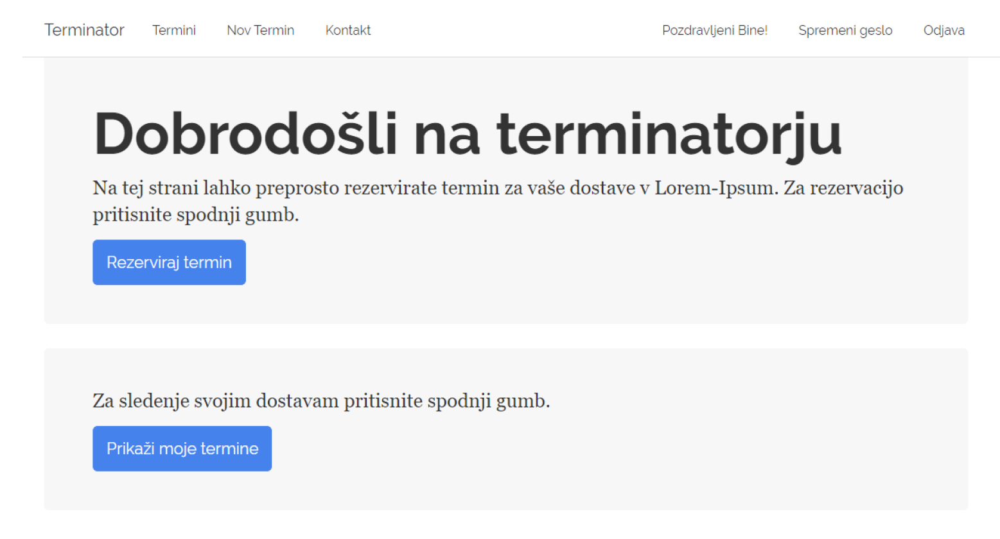

### Terminator

Terminator ("termin" is "schedule" in Slovenian) is a scheduling web application made using the Asp.NET MVC framework.

### Description

I made terminator as a part of an online hackathon hosted by "mojedelo.com". 
We were required to create a scheduling application with Asp.NET MVC, for the warehousing company "Lorem-Ipsum".
Several different user types are defined with the details being saved into a MSSQL database:
- Regular user: Can reserve/check dates for picking up wares
- Guest: Same as Regular user, but needs a tracking id if he/she wants to check up on his/her reservations 
- Admin: Can delete/edit reservations at will, and promote Regular users to warehouse workers.
- Warehouse worker: Can accept/decline reservations or add a note to them.

The requirements and functionalities of the web application were mostly predetermined by the hackathon organizers. 
Unfortunately I did not end up having much time so I made a nearly minimal working product. 
A presentation of the project that I submitted is in "Overview.pdf" file (looking back, that presentation is very rushed as well...).

### Screenshot of how the website looked like

    

